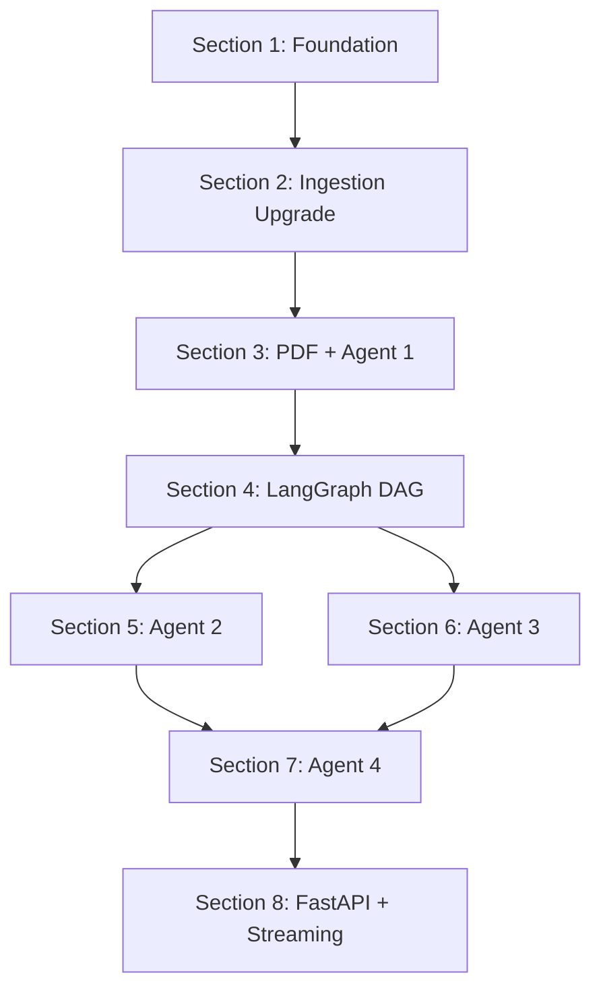
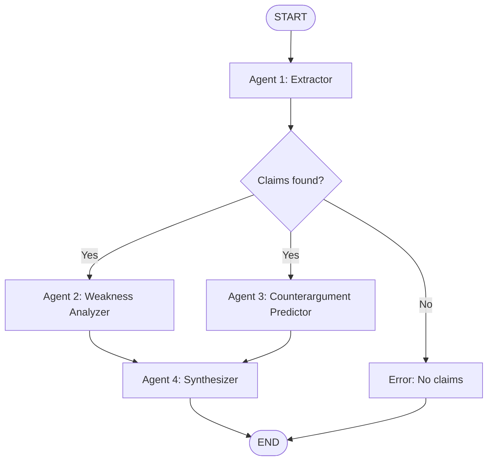

# Legal Brief Analyzer — POC/MVP Roadmap

> Scope: proof-of-concept. No paid infra (Pinecone, Voyage). Local NumPy vector store, OpenAI embeddings (key already set), minimal error handling. Upgrade path to production noted where relevant.

## What Already Exists

- [data_collection/](data_collection/) — 3-source ingestion (Harvard Caselaw, CourtListener, SEC EDGAR): 1,000 docs
- [data_collection/chunker.py](data_collection/chunker.py) — Sentence-boundary-aware chunking: 7,855 chunks
- [data_collection/embedder.py](data_collection/embedder.py) — Local `all-MiniLM-L6-v2` embeddings in NumPy
- [data_collection/vector_store.py](data_collection/vector_store.py) — NumPy cosine similarity search with `source_filter`
- [vectorstore/](vectorstore/) — `embeddings.npy` (7,855 x 384) + `metadata.json`
- `.env` has `OpenAI_API_KEY` and `Anthropic_API_KEY` already set

## What Needs to Be Built




---

## Section 1 — Project Foundation

Lay out the `app/` package, install the LangGraph/LangChain stack, and define all shared data contracts.

**Target structure:**

```
Lawyer.com/
├── app/
│   ├── __init__.py
│   ├── config.py              # env vars, model names, paths
│   ├── schemas.py             # all Pydantic models (shared contracts between agents)
│   ├── state.py               # AgentState TypedDict
│   ├── graph.py               # LangGraph DAG definition
│   ├── agents/
│   │   ├── __init__.py
│   │   ├── extractor.py       # Agent 1
│   │   ├── weakness.py        # Agent 2
│   │   ├── counterargument.py # Agent 3
│   │   └── synthesizer.py     # Agent 4
│   ├── tools/
│   │   ├── __init__.py
│   │   ├── vector_search.py   # LangChain @tool wrapping NumPy VectorStore
│   │   └── pdf_parser.py      # PyMuPDF text extraction
│   └── prompts/
│       ├── extractor.py
│       ├── weakness.py
│       ├── counterargument.py
│       └── synthesizer.py
├── data_collection/           # existing — no changes
├── vectorstore/               # existing — will be re-embedded with OpenAI
├── requirements.txt
├── .env
└── run.py                     # CLI entry point for testing
```

**Tasks:**

- Add to `requirements.txt`: `langgraph`, `langchain`, `langchain-openai`, `pymupdf`, `pydantic`, `fastapi`, `uvicorn`, `sse-starlette`
- Create `app/config.py` — loads `OpenAI_API_KEY` from `.env`, sets model name (`gpt-4o-mini` for POC to keep costs low), paths to vectorstore
- Create `app/schemas.py` — all Pydantic models used across agents (detailed in Sections 3/5/6/7)

---

## Section 2 — Ingestion Upgrade

Keep the NumPy vector store. Upgrade embeddings from `all-MiniLM-L6-v2` (384-dim) to OpenAI `text-embedding-3-small` (1536-dim) for better retrieval quality. Add metadata fields so agents can filter by jurisdiction/year.

**What changes:**

- [data_collection/embedder.py](data_collection/embedder.py) — swap `SentenceTransformer` for `openai.OpenAI().embeddings.create()`, save as 1536-dim `.npy`
- [data_collection/vector_store.py](data_collection/vector_store.py) — extend metadata with `jurisdiction`, `case_type`, `year` parsed from raw doc JSON; add multi-field filtering to `search()`

**Metadata extraction logic (from existing raw JSON fields):**

- `jurisdiction`: caselaw docs have `doc.jurisdiction`, CourtListener has `doc.court`, EDGAR has `doc.state[0]`
- `case_type`: derive from source — `"case_law"` for caselaw/CourtListener, `"filing"` for EDGAR
- `year`: parse from `doc.date` or `doc.filing_date`

**Tasks:**

- Update `embedder.py` to call OpenAI embeddings API in batches (~$0.02 total for 7,855 chunks)
- Update `vector_store.py` to load enriched metadata and support `search(query, jurisdiction=None, case_type=None, year_range=None)`
- Run re-embedding, verify search still works

**Production upgrade path:** swap NumPy for Pinecone + `voyage-law-2` when scaling past ~50K vectors.

---

## Section 3 — PDF Parsing + Agent 1 (Extractor)

Entry point of the runtime DAG. User uploads a legal brief PDF; Agent 1 converts it to the typed structured representation all downstream agents consume.

**PDF Parser (`app/tools/pdf_parser.py`):**

- PyMuPDF (`fitz`) extracts text page-by-page
- Strip headers/footers/page numbers with simple heuristics (repeated lines across pages)
- Return single clean text string

**Structured Output Schema (in `app/schemas.py`):**

```python
class Party(BaseModel):
    name: str
    role: str  # "plaintiff", "defendant", "appellant", etc.

class Claim(BaseModel):
    claim_id: int
    text: str
    legal_basis: str
    supporting_facts: list[str]

class BriefExtraction(BaseModel):
    parties: list[Party]
    claims: list[Claim]
    facts: list[str]
    relief_sought: str
    jurisdiction: str
    case_type: str
    procedural_posture: str
```

**Agent 1 (`app/agents/extractor.py`):**

- Uses `ChatOpenAI(model="gpt-4o-mini").with_structured_output(BriefExtraction)`
- System prompt scoped strictly to extraction — no analysis, no opinions
- No tools, no RAG — pure extraction chain
- Input: raw PDF text from state → Output: `BriefExtraction` written to `AgentState`

---

## Section 4 — LangGraph DAG + State Schema

Wire the graph skeleton: state definition, node functions, conditional edge, fan-out/fan-in.

**AgentState (`app/state.py`):**

```python
class AgentState(TypedDict):
    pdf_text: str
    extraction: Optional[dict]              # serialized BriefExtraction
    weaknesses: Optional[list[dict]]        # serialized WeaknessReports
    counterarguments: Optional[list[dict]]  # serialized Counterarguments
    strategy: Optional[dict]                # serialized StrategyReport
    error: Optional[str]
```

*(Use `dict` in the TypedDict since LangGraph state must be JSON-serializable. Pydantic models serialize via `.model_dump()` at write and validate via `Model(**state["field"])` at read.)*

**Graph (`app/graph.py`):**




**Tasks:**

- Define `AgentState` in `app/state.py`
- Build `app/graph.py`:
  - `StateGraph(AgentState)` with nodes: `extractor`, `weakness`, `counterargument`, `synthesizer`, `error`
  - Conditional edge after extractor: route to parallel branch or error
  - Fan-out Agent 2 + Agent 3 using `Send()` API
  - Agent 4 runs after both resolve (LangGraph handles join automatically)
- Add `run.py` to test: load a sample PDF, invoke `graph.invoke()`, print result
- For POC: compile without a checkpointer (`graph.compile()`). Add SQLite checkpointer later if needed.

---

## Section 5 — Agent 2 (Weakness Analyzer)

Core RAG agent. For each claim, retrieve relevant precedent and score how well-supported it is.

**Vector Search Tool (`app/tools/vector_search.py`):**

- LangChain `@tool` wrapper around the existing `VectorStore`
- Signature: `search_case_law(query: str, jurisdiction: str = "", top_k: int = 8) -> str`
- Loads the singleton `VectorStore` at import time (loaded once, stays in memory)
- Returns formatted string of top-K results with title, court, date, and text snippet

**Agent 2 (`app/agents/weakness.py`):**

- System prompt: "For each claim, search for precedent in the same jurisdiction. Assess whether the claim has strong, weak, or contradictory precedent support."
- Bound tools: `search_case_law`
- Uses `create_react_agent()` from LangGraph — the agent decides when/how to call the tool
- Output written to state as `list[WeaknessReport]`:

```python
class CaseCitation(BaseModel):
    title: str
    court: str
    date: str
    relevance: str  # one-line explanation

class WeaknessReport(BaseModel):
    claim_id: int
    weakness_score: float  # 0.0 (strong) to 1.0 (very weak)
    supporting_cases: list[CaseCitation]
    contradicting_cases: list[CaseCitation]
    reasoning: str
```

---

## Section 6 — Agent 3 (Counterargument Predictor)

Same `search_case_law` tool, adversarial retrieval strategy. Runs in parallel with Agent 2.

**Agent 3 (`app/agents/counterargument.py`):**

- System prompt: "You are opposing counsel. For each claim, search for cases where similar arguments FAILED or the opposing side won. Predict the strongest counterarguments."
- Bound tools: `search_case_law`
- The prompt instructs the agent to invert queries (e.g., "breach of fiduciary duty" becomes "defense against fiduciary duty" or "fiduciary duty claim dismissed")
- Output written to state as `list[Counterargument]`:

```python
class Counterargument(BaseModel):
    claim_id: int
    predicted_rebuttal: str
    grounding_cases: list[CaseCitation]
    severity: str  # "minor", "moderate", "critical"
    suggested_preemption: str
```

---

## Section 7 — Agent 4 (Synthesizer)

No RAG, no tools. Pure reasoning over accumulated state.

**Agent 4 (`app/agents/synthesizer.py`):**

- System prompt: "You are a senior litigation strategist. Given the extracted claims, weakness analysis, and predicted counterarguments, produce a prioritized action plan."
- Reads full state: extraction + weaknesses + counterarguments
- Uses `with_structured_output(StrategyReport)` to force typed output:

```python
class StrategyAction(BaseModel):
    priority: int
    action: str
    rationale: str
    confidence: float
    related_claims: list[int]

class StrategyReport(BaseModel):
    overall_assessment: str  # "strong", "moderate", "weak"
    actions: list[StrategyAction]
    key_risks: list[str]
    recommended_focus_areas: list[str]
```

- This is the final output of the DAG.

---

## Section 8 — FastAPI + Streaming

Expose the graph as an API. SSE streaming so a frontend can show per-agent progress.

**Tasks:**

- Create `app/api.py` with FastAPI:
  - `POST /analyze` — accepts PDF upload, runs graph, returns result JSON
  - `POST /analyze/stream` — accepts PDF upload, returns SSE stream via `graph.astream_events()`
  - `GET /health` — readiness check (vectorstore loaded, model accessible)
- SSE events emitted per node transition:

```json
{"event": "agent_start", "agent": "extractor"}
{"event": "agent_complete", "agent": "extractor", "claims_found": 4}
{"event": "agent_start", "agent": "weakness_analyzer"}
{"event": "agent_start", "agent": "counterargument_predictor"}
{"event": "agent_complete", "agent": "weakness_analyzer"}
{"event": "agent_complete", "agent": "counterargument_predictor"}
{"event": "agent_start", "agent": "synthesizer"}
{"event": "final_result", "strategy": {...}}
```

- Add `run.py` as CLI alternative: `python run.py path/to/brief.pdf` prints the strategy report to stdout
- Run with `uvicorn app.api:app --reload`

**Production upgrade path:** add `SqliteSaver` checkpointer for resumability, `thread_id`-based result caching, auth middleware.